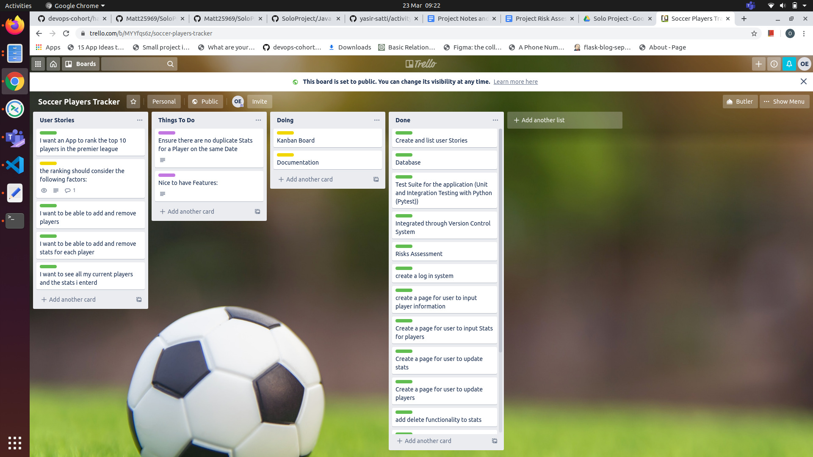
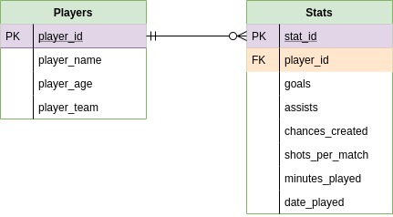
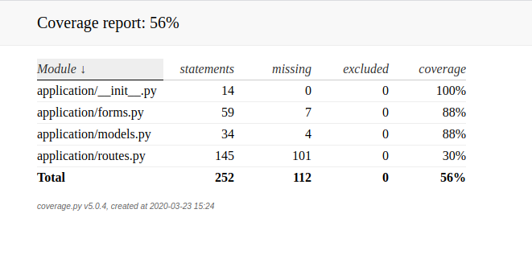

# Soccer Players Tracker
A solo project to fulfill the DevOps Fundamentals Project Specifications 

## Index
* [Brief](#brief)
* [Solution](#solution)
* [Risk Assessment](#risks)
* [Kanban!](#kan)
* [Entity Relationship Diagrams](#erd)
* [Testing](#testing)
* [Deployment](#deployment)
* [Front End Design](#FE)
* [Relevent Information and Links](#rel)

## Brief 
The client ( My Step-Son ) wanted an application to help him keep track of certain premier league players and save some details that he will later on perform statistical calculations on to help him predict the player’s future performance.
He wanted the freedom to add or remove players as needed and also the freedom to edit or remove certain stats on certain dates for certain players.

## Solution

To workout the solution utilising the supporting tools, technologies and methodologies covered during the training in the academy, I’ve decided the following:

* Adopt Agile methods to manage my project
* Perform risk assessment using the outline covered during the training
* Implement kanban method using Trello
* Build database ERD using Draw.io
* Create Git repository to be my VCS
* Use MySQL server, HTML5, CSS3 , Python, Flask and a few more python modules  to build and test the application (refer to the requirements.txt for more details )
* Host the Application ( MySQL Database Server, Linux Web Application Server and Linux server hosting the automated deployment server for continuous integration ‘Jenkins’ ) on Google Cloud Platform ( free tier )
* Test the application
* Deploy the application

Let's cover as much as possible from above

## Risk Assessment
| Risks                            | Likelihood    | Impact       | 
| -------------------------------- |:-------------:| :-----------:| 
| Wrong interpretation of client needs | Low           | High         | 
| Lack of Technical knowledge      | Medium        |   Medium     | 
| Automation causing issues        | Low            |  High        | 
| Exposure of sensitive information  | Low     |    High | 
| Running out of GCP credit        |   Low     |    High       | 

##### Wrong interpretation of client needs
This risk was mitigated by having regular meetings with the client throughout the development cycle to ensure that the product is meeting the client expectations.
##### Lack of Technical knowledge
This risk was mitigated by constantly reviewing each step and refereing to documentations and best practices provided in the training and from other sources
##### Automation causing issues
This risk was mitigated by testing the automation process with a simple ‘Hello World’ application to ensure that the CI Pipeline is functional, Also keeping the server on to avoid having the IP address change
##### Exposure of sensitive information
This risk was mitigated by using the best practice of exporting sensitive information as variables for the each application administration session only
 
##### Running out of GCP free Balance
This one was mitigated by using micro VM instances as they don’t cost much

## Kanban Board
To create a back-log for the application and to also keep track of my progress while developing the application, I used Trello Board. It contained all the user stories and my To Do list. It gets updated regularly.

## Entity Relationship Diagrams
#### Initial ERD plan

#### Delivered ERD solution

#### Database Scheme

## Testing
The Testing for the application was done using pytest in conjunction with selenium module, the test only covered the pages that doesn't require login using the backend test. but using seleinum a test to the login protected was preformed successfully although it doesn't show on the coverage report.

## Deployment 

## Relevant information and links

* Application link : http://35.246.46.9:8080/
* Jenkins link: http://35.189.64.220:8080/
* Trello Board Link: https://trello.com/b/MYYfqs6z/soccer-players-tracker

To get this app running locally on an ubuntu machine below are extra requirements which are not mentioned in the requirements.txt.
Python 3
Virtual Eviroment
A secret Key exported 
MySQL Server 5.7

Setup:
Web Application Screenshots:

### Author
Osman Elsahib
### Acknowledgements
My deepest regards and appreciation goes to the QA Academy team, and even more special regards goes to Luke and Ben for their wonderful delivery of the training materials and their non-stop support.

